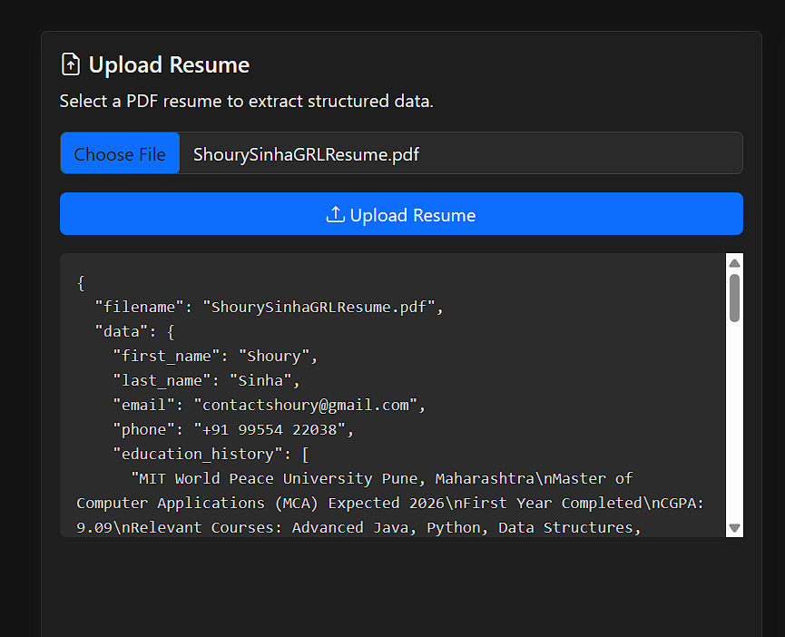
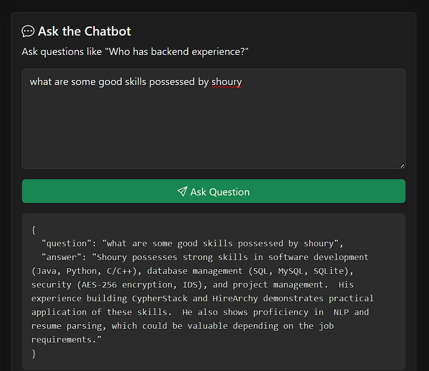

# AI-Powered Resume Parser and HR Assistant

## Project Overview

This project is an AI-based resume parsing and HR assistant tool. It extracts structured data from resumes using large language models (LLMs) like Gemini or Hugging Face models, and also answers HR-style questions about candidates. The system includes:

* Resume parsing to extract name, contact details, education, skills, etc.
* A chatbot to evaluate candidates based on parsed resume info
* Vector storage using ChromaDB for context search
* A simple frontend built with HTML, CSS, and JavaScript

---

## Setup Instructions

1. **Clone the repository**
   Open your terminal and run:

   ```
   git clone https://github.com/your-username/your-repo-name.git
   cd your-repo-name
   ```

2. **Set up a virtual environment**

   ```
   python -m venv venv
   source venv/bin/activate     # For Windows: venv\Scripts\activate
   ```

3. **Install dependencies**

   ```
   pip install -r requirements.txt
   ```

4. **Create a `.env` file**

   Add your Gemini or Hugging Face API key to a `.env` file:

   ```
   GOOGLE_API_KEY=your_api_key_here
   ```

5. **Run the application**

   ```
   python app/main.py
   ```

6. **Open the frontend**

   Open `frontend/frontend.html` in your browser to use the tool.

---

## Images

* Screenshot of Resume Parsing: 

* Screenshot of Chatbot Answering:  
### Video Demo

🎥 [Watch Demo on Loom]([https://www.loom.com/share/eb8200f37a174be5a1beccc0d496b3a4?sid=fce2fa69-2804-4cc3-8af9-93bf4ae50f75](https://www.loom.com/share/2e4f03938dc844b5987f82632b73067b?sid=a287d06b-6c4c-4c28-99fa-38871eb5da3c))


---

## Assumptions and Limitations

* Only supports plain text input. PDF support requires an external extractor.
* Gemini or Hugging Face API usage may be rate-limited if using a free tier.
* ChromaDB is local-only, not shared across systems.
* Only one resume can be parsed at a time in the current version.

---

## Future Improvements

* Add PDF-to-text converter for broader resume format support
* Batch resume uploading and parsing
* Improved candidate comparison and ranking
* Authentication and dashboard for HR managers
* Deploy backend with FastAPI or Flask + React for frontend

---

## AI Architecture Diagram (Text Version)


## Contact

For questions or contributions, open a GitHub issue or email: \[[contactshoury@gmail.com](mailto:contactshoury@gmail.com)]

